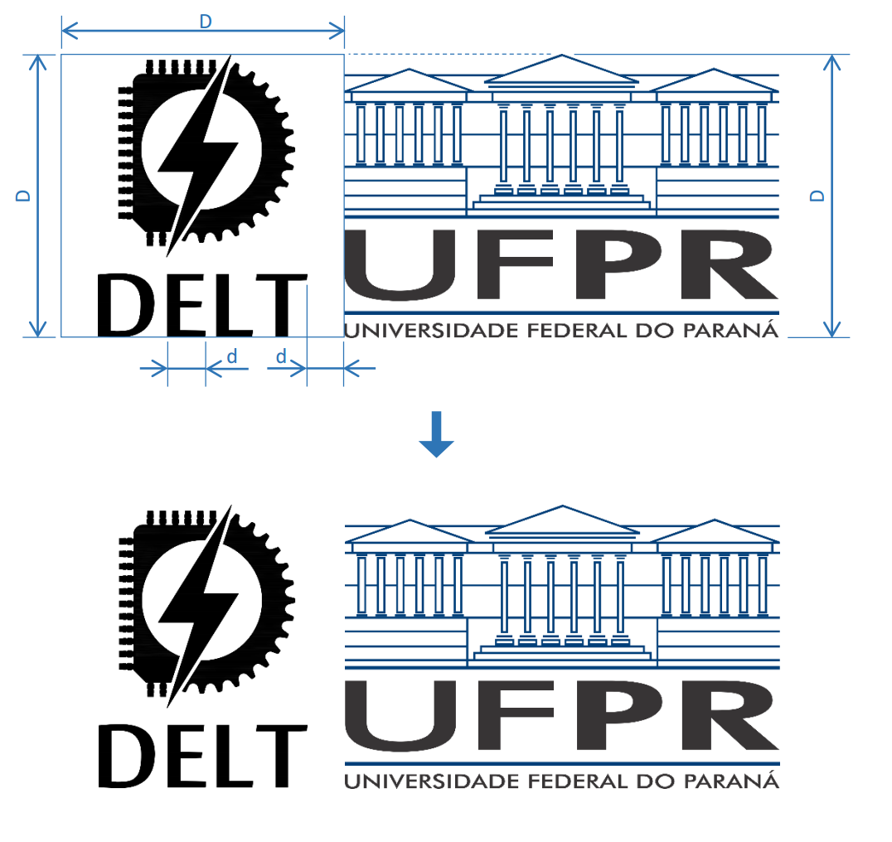

Logo DELT
=====

Logo do Departamento de Engenharia Elétrica da UFPR a partir de Julho de 2017, escolhido em um concurso de "identidade visual" (apenas o logo mesmo) por ocasião do jubileu de 50 anos do curso.  
Este repositório contém alguns formatos prontos para uso, bem como os originais em .dwg e .svg.

A especificação do concurso pedia um logo quadrado, então imaginem que os limites do logo incluam bordas laterais da largura de uma letra 'E' ou 'L' do próprio logo (veja abaixo).  
Quando usado ao lado de logos retangulares, como o da UFPR, me parece melhor que se escalone o logo até que ambos tenham a mesma altura. A não ser que o logo retangular seja muito baixo e largo.

